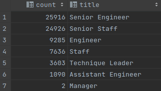
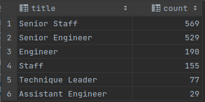
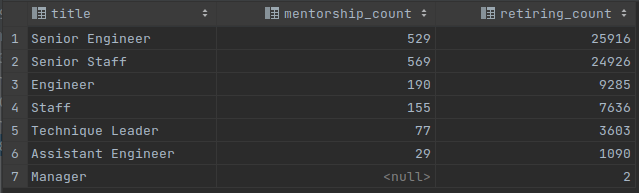

# Module 7 - Pewlett-Hackard-Analysis

## Overview of the analysis
The purpose of this analysis was to help the manager prepare for the upcoming "silver tsunami". Many current employees are reaching retirement age. We need to determine the number of retiring employees per title, and identify employees who are eligible to participate in a mentorship program.

## Results


* The top two roles retiring by count are Senior Engineer and Senior Staff
* Only 2 managers are retiring
* There is a similar distribution of eligible mentors as retiring employees - see: 


* There are no managers eligible for mentorship

## Summary
1. How many roles will need to be filled as the "silver tsunami" begins to make an impact? **72458**
2. Are there enough, qualified, retirement-ready employees in the departments to mentor the next generation of Pewlett Hackard employees? **No, there are no managers available.**
3. The following query was used to analyze mentorship_eligibility and compare it to retiring_titles:

```sql
SELECT rt.title, mes.count as mentorship_count, rt.count as retiring_count
FROM (SELECT title, count(*)
      FROM mentorship_eligibility
      GROUP BY title
      ORDER BY 2 DESC
) as mes
    FULL OUTER JOIN retiring_titles rt ON rt.title = mes.title;
```
4. The following is the output of this query:

